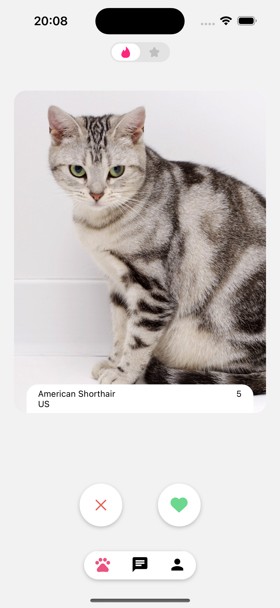

## 📝 Project Description

TinderCat is a dating app for cats and their humans. create just for fun and to practice my skills with React Native and reanimated.

## 💻 Tech Stack

- Frontend: React Native
- Tanstack Query
- React Navigation
- Axios
- React Native Reanimated
- React Native Gesture Handler

## Layout

## How to run the project

1. Clone the repository
2. Run `yarn install`
3. Add a `.env` file in the root of the project with the following variables:
    - `EXPO_PUBLIC_API_URL`
    - `EXPO_PUBLIC_API_KEY`
4. Run `yarn start`
5. Run `yarn ios` or `yarn android`

Made with ❤️ for cats and their humans
